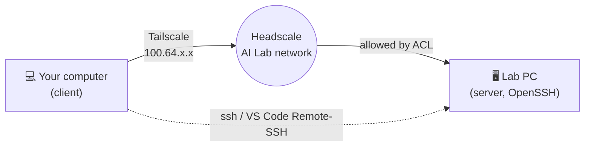

&nbsp;&nbsp;
&nbsp;&nbsp;

# AI Lab Remote Access Configuration

Connect to AI Lab computers over **SSH**, from the lab or from anywhere through the AI Lab **Tailscale** network 
(Headscale at `https://headscale.ailab-sdu.com`), and work on them in **VS Code**.

---

## How it works

* **Server** is the lab computer you connect **to**.
* **Client** is your own computer you connect **from**.

## Guides

| |  Windows |  Ubuntu |
|---|---|---|
|  **Server: SSH** install and start OpenSSH Server | [server/ssh/windows](server/ssh/windows/README.md) | [server/ssh/ubuntu](server/ssh/ubuntu/README.md) |
|  **Server: Tailscale** join the lab network | [server/tailscale/windows](server/tailscale/windows/README.md) | [server/tailscale/ubuntu](server/tailscale/ubuntu/README.md) |
|  **Client: Tailscale** join the lab network | [client/tailscale/windows](client/tailscale/windows/README.md) | [client/tailscale/ubuntu](client/tailscale/ubuntu/README.md) |
|  **Client: SSH** keys and config file | [client/ssh/windows](client/ssh/windows/README.md) | [client/ssh/ubuntu](client/ssh/ubuntu/README.md) |
|  **Client: VS Code** Remote-SSH connection | [VS Code on Windows](client/ssh/windows/README.md#6-connect-with-vs-code-remote---ssh) | [VS Code on Ubuntu](client/ssh/ubuntu/README.md#6-connect-with-vs-code-remote---ssh) |

## Recommended order

1.  **On the server:** set up SSH,
   then  join Tailscale.
2.  **On the client:** join Tailscale with the auth key from the sysadmin.
3.  **On the client:** set up SSH: key and config file.
4.  **Connect:** `ssh <host>` in a terminal, or **Remote-SSH: Connect to Host...** in VS Code.

> [!NOTE]
> Access to each host is controlled by the sysadmin's **Access Control List (ACL)**. If a host is not reachable, ask the sysadmin.
